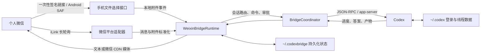

# CodexBridge

CodexBridge 是一个以 Codex 为执行核心的聊天平台桥接器。当前主要目标是把个人微信接入本机或服务器上的 Codex，让用户可以直接在微信里用自然语言发起任务、管理 Codex 会话、处理审批、查看进度以及收发文件。

本项目不是简单地把微信消息转成终端命令，也不是远程控制 Codex 桌面窗口。桥接器通过 Codex app-server 与 Codex 线程交互，并复用主机上的 `CODEX_HOME`、登录状态、模型配置和线程数据。因此 Codex 桌面程序不需要一直打开，但承载 CodexBridge 的电脑必须处于开机、未休眠且联网状态。

## 项目状态

- 当前主要交付方向：`微信 + Codex`
- 微信桥接、Codex 会话、文件收发、审批和后台服务均可使用
- `packages/codex-gateway`：暂停开发
- `packages/mission-control`：暂停开发
- `packages/codex-native-api`：保留为后续方案，当前暂停主动开发
- 核心原则：微信只负责消息适配，Codex 负责推理和执行，Codex 原生线程是会话状态的事实来源

## 已实现功能

### 微信自然语言交互

- 在微信中直接发送自然语言任务，不需要输入终端命令
- 将 Codex 的进度更新和最终答案发送回原微信会话
- 支持长消息分片、失败重试和微信发送限流提示
- 任务运行期间显示“正在输入”，完成或 `/stop` 后可靠停止输入状态
- 支持中文和英文界面消息，可通过 `/lang` 切换

### Codex 会话管理

- 新建、搜索、浏览、打开、预览和重命名 Codex 线程
- 微信端使用数字序号选择线程，不需要复制完整线程 ID
- `/open` 打开历史线程时会返回最近内容预览
- 微信会话与 Codex 线程绑定关系持久化，服务重启后继续使用
- 线程异常或失效时支持自动恢复、`/reconnect`、`/retry` 和 `/new`

### 模型、推理与权限

- 查看和切换 Provider、模型及推理强度
- 支持会话级 `low`、`medium`、`high`、`xhigh` 等推理强度
- 支持快速模式、人格和计划模式
- 支持默认审批、自动审查、完全访问和本地自定义权限模式
- Codex 请求审批时，可在微信使用 `/allow` 或 `/deny` 处理
- `/stop` 可中断当前 Codex 回合，旧回合不会继续刷新“正在输入”状态

### 文件、图片、语音和视频

- 接收微信直接发送或引用转发的文件消息
- 从微信 CDN 下载加密附件，在本地解密并保存到状态目录
- 将附件作为当前 Codex 回合的输入，而不是要求用户手动下载再上传
- 支持图片、普通文件、语音和视频附件的标准化处理
- Codex 生成的文件和图片可以通过微信 CDN 上传并发送回手机
- 图片压缩、视频信息探测和缩略图生成使用项目管理的 `ffmpeg`/`ffprobe`
- 默认单个入站媒体上限为 100 MiB；出站产物默认最多 3 个、单个最多 25 MiB
- 支持在微信发送 `/pickfile`，打开一次性链接后从 Android“微信聊天文档”选择文件
- 手机选择页将文件流式上传到当前微信会话，不需要先下载到手机的普通下载目录再重新发送

### 自动化和个人助手

- 使用自然语言创建、确认、暂停、恢复和删除定时任务
- 自动化结果回传到创建任务的微信会话
- 支持日志、待办、提醒和笔记
- 支持先上传附件，再把附件归档到个人助手记录
- 支持 Skills、Plugins、Apps 和 MCP 能力发现与选择

### Provider 支持

- 默认使用主机上的原生 Codex 登录和订阅
- 支持 OpenAI-compatible Responses 适配层
- 已内置 DeepSeek、MiniMax、Qwen、OpenRouter、Kimi、Gemini 和 iFlow 等能力预设
- 支持流式响应、工具调用修复、compact 回退、usage 适配和模型能力元数据

## 工作原理



处理流程：

1. 微信适配器通过 iLink 长轮询接收消息，并保存同步游标和 context token。
2. 图片、文件、语音或视频从微信 CDN 下载，按消息中的密钥解密后写入 `~/.codexbridge/weixin/inbound/`。
3. Runtime 合并同一条消息的文本与附件，并按微信会话 ID 串行调度任务。
4. 普通文字交给 Codex；斜杠命令由 BridgeCoordinator 处理或转换成 Codex 原生操作。
5. Codex app-server 返回 commentary、审批请求、最终答案和产物清单。
6. Runtime 将进度和最终结果去重后发送到微信；文件和图片先上传微信 CDN，再投递给用户。
7. 会话绑定、模型、权限、自动化和个人助手数据使用 JSON 文件持久化。

## 目录结构

```text
src/
  core/                 会话路由、命令、审批、自动化和产物处理
  platforms/weixin/     微信登录、轮询、CDN、附件和消息发送
  providers/            Codex 与 OpenAI-compatible Provider
  runtime/              微信桥接运行时、进度和 typing 生命周期
  store/                文件持久化仓库
packages/               暂停或保留的实验性包
scripts/service/        Windows、Linux、macOS 后台服务脚本
config/examples/        服务环境变量示例
docs/                   架构、路线图和完整指令文档
test/                   单元测试与集成测试
```

## 环境要求

- Node.js `>= 24`
- npm
- 主机上可运行的 Codex 可执行文件
- 已完成 Codex 登录，默认认证文件位于 `~/.codex/auth.json`
- 能正常访问微信和 Codex 所需网络

安装 Codex：

```powershell
npm install -g @openai/codex@latest --include=optional
codex --version
```

如果同时安装了多个 Codex 包装器，建议把 `CODEX_REAL_BIN` 设置为原生 `codex.exe` 或实际可执行文件的绝对路径。

## 快速部署

### Windows 11 / PowerShell

克隆并验证项目：

```powershell
git clone https://github.com/ywj-SCUT/CodexBridge-revise.git
Set-Location -LiteralPath '.\CodexBridge-revise'
npm install
npm run typecheck
npm test
codex --version
```

首次绑定微信：

```powershell
npm run weixin:login
```

命令会生成二维码并等待扫描。登录成功后，微信账户信息保存在：

```text
%USERPROFILE%\.codexbridge\weixin\accounts\
```

前台启动并指定 Codex 默认工作目录：

```powershell
npm run weixin:serve -- --cwd "$HOME\Documents\Codex"
```

确认微信可以使用后，安装隐藏的计划任务：

```powershell
pwsh -ExecutionPolicy Bypass -File .\scripts\service\install-windows-task.ps1 `
  -DefaultCwd "$HOME\Documents\Codex"
```

默认任务在用户登录后启动。需要电脑开机后以 `SYSTEM` 账户启动时，请在管理员 PowerShell 中执行：

```powershell
pwsh -ExecutionPolicy Bypass -File .\scripts\service\install-windows-task.ps1 `
  -AtStartup `
  -HomeDir $HOME `
  -DefaultCwd "$HOME\Documents\Codex"
```

Windows 服务配置文件：

```text
%APPDATA%\codexbridge\weixin.service.env
```

建议配置：

```dotenv
WEIXIN_ACCOUNT_ID=
WEIXIN_DM_POLICY=open
WEIXIN_GROUP_POLICY=disabled
CODEX_DEFAULT_PROVIDER_PROFILE_ID=openai-default
CODEXBRIDGE_DEFAULT_MODEL=gpt-5.6-sol
CODEXBRIDGE_DEFAULT_REASONING_EFFORT=high
CODEX_REAL_BIN=C:\absolute\path\to\codex.exe
CODEXBRIDGE_DEBUG_WEIXIN=0
```

修改源码或环境变量后重启服务：

```powershell
pwsh -ExecutionPolicy Bypass -File .\scripts\service\restart-windows-task.ps1
```

查看状态与日志：

```powershell
pwsh -ExecutionPolicy Bypass -File .\scripts\service\status-windows-task.ps1
pwsh -ExecutionPolicy Bypass -File .\scripts\service\logs-windows-task.ps1
pwsh -ExecutionPolicy Bypass -File .\scripts\service\logs-windows-task.ps1 -Follow
```

日志默认位于：

```text
%USERPROFILE%\.codexbridge\logs\weixin-bridge.out.log
%USERPROFILE%\.codexbridge\logs\weixin-bridge.err.log
```

### Linux / systemd

```bash
git clone https://github.com/ywj-SCUT/CodexBridge-revise.git
cd CodexBridge-revise
npm install
npm run typecheck
npm test
codex --version
npm run weixin:login
bash ./scripts/service/install-systemd-user.sh
```

服务管理：

```bash
bash ./scripts/service/status-systemd-user.sh
bash ./scripts/service/restart-systemd-user.sh
bash ./scripts/service/logs-systemd-user.sh
bash ./scripts/service/logs-systemd-user.sh --follow
```

systemd 安装器使用 `Restart=always`，并尝试启用用户 linger。需要手动启用时执行：

```bash
loginctl enable-linger "$USER"
```

Linux 服务配置文件：

```text
~/.config/codexbridge/weixin.service.env
```

### macOS / launchd

```bash
npm install
npm run typecheck
npm test
npm run weixin:login
bash ./scripts/service/install-launchd-user.sh
```

服务管理：

```bash
bash ./scripts/service/status-launchd-user.sh
bash ./scripts/service/restart-launchd-user.sh
bash ./scripts/service/logs-launchd-user.sh
bash ./scripts/service/logs-launchd-user.sh --follow
```

## 微信常用指令

微信中的普通任务直接使用自然语言。斜杠指令主要用于管理桥接状态、会话、模型和审批。

### 状态与运行控制

| 指令 | 作用 |
| --- | --- |
| `/helps`、`/h` | 查看指令帮助 |
| `/status`、`/st` | 查看当前 Provider、线程、模型和运行状态 |
| `/usage` | 查看账户和额度摘要 |
| `/login`、`/login list` | 登录 Codex 或查看已保存账户 |
| `/stop`、`/sp` | 中断当前回复 |
| `/retry`、`/rt` | 刷新会话并重试上一条自然语言请求 |
| `/reconnect` | 重新连接当前 Codex 会话 |
| `/restart` | 请求重启桥接服务 |

### 会话管理

| 指令 | 作用 |
| --- | --- |
| `/new` | 在默认工作目录新建 Codex 线程 |
| `/new C:\path\to\project` | 在指定目录新建线程 |
| `/threads`、`/th` | 列出最近线程 |
| `/search 关键词` | 搜索历史线程 |
| `/next`、`/prev` | 翻页 |
| `/open 2` | 打开列表中的第 2 个线程并显示预览 |
| `/peek 2` | 只预览第 2 个线程 |
| `/rename 2 新名称` | 重命名线程 |
| `/compact` | 压缩当前原生 Codex 线程上下文 |
| `/goal` | 查看或管理实验性原生目标状态 |

### 模型和行为

| 指令 | 作用 |
| --- | --- |
| `/provider` | 查看或切换 Provider |
| `/models`、`/ms` | 列出当前 Provider 可用模型 |
| `/model` | 查看当前模型和推理强度 |
| `/model gpt-5.6-sol high` | 设置模型和推理强度 |
| `/model high` | 只修改推理强度 |
| `/model default` | 恢复默认模型配置 |
| `/fast`、`/fast off` | 开启或关闭快速服务层 |
| `/personality pragmatic` | 设置当前会话的人格风格 |
| `/plan on`、`/plan off` | 开启或关闭计划模式 |
| `/lang zh-CN`、`/lang en` | 切换桥接回复语言 |

### 权限和审批

| 指令 | 作用 |
| --- | --- |
| `/permissions`、`/perm` | 查看权限模式 |
| `/perm default-permissions` | 工作区可写，越界操作时请求用户批准 |
| `/perm auto-review` | 工作区可写，由审查代理处理合格的审批请求 |
| `/perm full-access` | 完全访问，`never` 审批策略 |
| `/perm custom` | 使用本地 `config.toml` 中的权限配置 |
| `/allow` | 查看待处理审批 |
| `/allow 1`、`/allow 2` | 选择审批选项 |
| `/deny` | 拒绝当前审批 |

完全访问允许 Codex 在主机上执行更广泛的操作，应只在信任当前微信账号和任务来源时启用。

### 文件和能力管理

| 指令 | 作用 |
| --- | --- |
| `/uploads`、`/up` | 进入文件暂存模式 |
| `/skills`、`/skills search 关键词` | 查看或搜索 Skills |
| `/plugins`、`/pg search 关键词` | 查看或搜索 Plugins |
| `/apps` | 查看可用 Apps |
| `/mcp` | 查看 MCP 能力 |
| `/use` | 选择当前任务要使用的能力 |
| `/review` | 对当前工作区执行 Codex 代码审查 |
| `/review base main` | 审查相对 `main` 的修改 |

### 自动化和个人助手

| 指令 | 作用 |
| --- | --- |
| `/auto add 每30分钟检查一次系统状态` | 创建自动化草稿 |
| `/auto confirm` | 确认创建 |
| `/auto list` | 查看自动化任务 |
| `/auto pause 1`、`/auto resume 1` | 暂停或恢复任务 |
| `/auto del 1` | 删除任务 |
| `/weibo top 10` | 获取微博热搜任务数据 |
| `/as ...` | 用自然语言创建或管理助手记录 |
| `/log ...` | 强制创建日志 |
| `/todo ...` | 创建或管理待办 |
| `/remind ...` | 创建提醒 |
| `/note ...` | 创建笔记 |
| `/instructions` | 查看当前 Codex 指令 |
| `/instructions edit 修改要求` | 生成 AGENTS.md 修改草稿 |

所有指令都支持指令级帮助：

```text
/threads -h
/open --help
/permissions -helps
```

完整指令说明见 [微信斜杠指令参考](./docs/usage/weixin-slash-commands.md)。

## 自然语言使用示例

```text
检查这个项目为什么测试失败，修复后运行完整测试
查看当前任务进度
把这份 Word 文档总结成一页中文报告并发给我
分析我刚才转发的图片
生成一个 Excel 文件并通过微信发送
明天上午 10 点提醒我检查服务器
每 30 分钟检查一次部署状态，异常时通知我
```

文件任务可以直接把文件投递给机器人，然后补充自然语言要求。附件到达后会先保存在运行 CodexBridge 的电脑或服务器，再作为 Codex 输入处理；微信手机端收到的是桥接器重新上传的结果文件，并不是 Codex 直接写入手机文件系统。

### 从“微信聊天文档”选择文件

在机器人会话发送：

```text
/pickfile
```

也可以直接附带处理要求：

```text
/pickfile 总结这些文件并生成一份中文报告
```

机器人会返回一个 10 分钟有效的一次性链接。在 Android 手机打开链接，点击文件选择框，进入系统文件选择器的“微信聊天文档”，选中文件并上传。上传完成后，文件会绑定到发起命令的微信会话并自动交给 Codex。简写命令为 `/pf`。

局域网使用时配置 `CODEXBRIDGE_MOBILE_UPLOAD_ENABLE=1` 即可。跨网络使用时，应通过 HTTPS 反向代理或隧道发布端口 `43183`，并把公开地址写入 `CODEXBRIDGE_MOBILE_UPLOAD_PUBLIC_BASE_URL`。服务使用随机令牌、过期时间、一次性提交、文件名净化、数量限制和大小限制；它只读取用户在手机系统选择器中主动选择的文件。

## 状态与数据目录

默认状态目录：

```text
~/.codexbridge/
```

主要内容：

```text
weixin/accounts/            微信账户和 context token
weixin/inbound/             从微信下载并解密的入站附件
weixin/inbound/mobile/      手机文件选择页上传的附件
weixin/login/               登录二维码
runtime/                    会话绑定、设置、自动化和运行状态
assistant/attachments/      个人助手记录附件
logs/                       后台服务日志
```

Codex 默认目录：

```text
~/.codex/auth.json          Codex 登录信息
~/.codex/AGENTS.md          Codex 全局指令
```

不要把 `.codexbridge`、Codex 登录文件、微信账户 JSON、Token、`.env` 或服务环境变量文件提交到 Git。

## OpenAI-compatible Provider

服务配置文件中可按需增加第三方 Provider：

```dotenv
DEEPSEEK_API_KEY=
DEEPSEEK_BASE_URL=https://api.deepseek.com
DEEPSEEK_DEFAULT_MODEL=deepseek-v4-flash

MINIMAX_API_KEY=
MINIMAX_BASE_URL=https://api.minimaxi.com/v1
MINIMAX_MODEL=MiniMax-M2.7

QWEN_API_KEY=
QWEN_BASE_URL=https://dashscope.aliyuncs.com/compatible-mode/v1
QWEN_DEFAULT_MODEL=qwen-plus

KIMI_API_KEY=
KIMI_BASE_URL=https://api.kimi.com/coding
KIMI_MODEL=kimi-k2
```

也可以配置一个通用兼容 Provider：

```dotenv
CODEX_COMPAT_PROVIDER_ID=custom
CODEX_COMPAT_PROVIDER_NAME=Custom Provider
CODEX_COMPAT_API_KEY=
CODEX_COMPAT_BASE_URL=https://provider.example/v1
CODEX_COMPAT_DEFAULT_MODEL=example-model
CODEX_COMPAT_CAPABILITIES=default
```

实时 Provider 冒烟测试默认关闭，避免普通测试消耗 API 额度。显式测试：

```powershell
npm run test:live-openai-compatible
npm run test:live-agent
```

## 验证与开发

```powershell
npm install
npm run typecheck
npm test
```

默认 `npm test` 会隔离实时 Provider 凭据，保证测试结果稳定。需要真实外部 Provider 时使用单独的 live 测试入口。

常用开发命令：

```powershell
npm run build
npm run weixin:login
npm run weixin:serve
npm run weixin:clear-context
npm run codex:cleanup-internal-threads
```

## 故障排查

### 微信绑定成功但没有回复

二维码登录只保存账户，不会自动启动后台循环。确认 `weixin:serve` 或系统服务仍在运行。

### 一直显示“对方正在输入中”

当前版本使用 typing 代际令牌和按会话串行发送，`/stop` 或新回合完成后，旧回合不能继续发送 typing 保活。旧版本升级后需要重启桥接服务。

### `spawn codex ENOENT`

先运行：

```powershell
codex --version
(Get-Command codex.exe).Source
```

然后在服务环境文件中设置 `CODEX_REAL_BIN` 的绝对路径。

### 中文路径乱码

使用 PowerShell 7，并通过变量和 `-LiteralPath` 传递中文路径。后台安装脚本会动态解析用户目录，不需要在脚本中硬编码中文用户名。

### 文件已收到但 Codex 没有处理

确认发送文件时当前会话没有其他回复正在运行。可先发送 `/stop`，等待停止确认后重新投递文件。入站文件可在 `~/.codexbridge/weixin/inbound/` 中核对。

### 电脑休眠或关机

计划任务、systemd 和 launchd 只能在主机开机、系统运行且网络可用时保持桥接。电脑休眠、关机或断网期间，微信无法通过该主机使用 CodexBridge。

## 相关文档

- [核心架构](./docs/architecture/codexbridge-core-architecture.md)
- [路线图](./docs/todo/roadmap.md)
- [Codex Native API 计划](./docs/todo/codex-native-api.md)
- [Codex Gateway 计划（暂停）](./docs/todo/codex-gateway.md)
- [Mission Control 计划（暂停）](./docs/todo/mission-control.md)
- [微信斜杠指令参考](./docs/usage/weixin-slash-commands.md)

## 运行边界

- 一个微信号可以绑定多台 CodexBridge，但每台机器应使用独立机器人账号或独立微信账户状态目录，避免 Token 和同步游标互相覆盖。
- CodexBridge 可以读取发送给机器人的微信消息和附件，不会自动读取未投递给机器人的其他私人聊天。
- 文件实际生成和处理发生在运行桥接器的电脑或服务器；发送到手机依赖微信上传和下载。
- 桌面端 Codex GUI 不需要保持打开，Codex 登录、可执行文件、线程存储和 CodexBridge 后台服务必须可用。
